# CI/CD Pipeline Documentation

This directory contains GitHub Actions workflows that implement a comprehensive CI/CD pipeline for SessionForge with **test-gated deployments**.

## 🏗️ Pipeline Overview

```mermaid
graph TD
    A[Code Push/PR] --> B[CI Pipeline]
    B --> C{Tests Pass?}
    C -->|❌ No| D[Block Merge]
    C -->|✅ Yes| E[Build & Security]
    E --> F{Quality Gates?}
    F -->|❌ No| G[Block Deployment]
    F -->|✅ Yes| H[Deploy]
    
    H --> I[Staging]
    I --> J[Production]
```



## 📄 Workflow Files

### Core Workflows

| Workflow | Purpose | Triggers |
|----------|---------|----------|
| **`ci.yml`** | Main CI/CD pipeline with test matrix | Push, PR |
| **`pr-checks.yml`** | Comprehensive PR validation | PR events |
| **`deploy-gated.yml`** | Test-gated deployment pipeline | Push to main |
| **`test-reporting.yml`** | Detailed test reports and coverage | Push, PR, Schedule |
| **`security.yml`** | Security scanning and dependency audits | Push, PR, Schedule |

### Key Features

## 🧪 Test Integration

### Test Requirements for Deployment

✅ **All tests must pass** (34+ tests)  
✅ **Coverage thresholds met**:
- Lines: 50%+ for production deployment
- Functions: 50%+ for production deployment  
- Branches: 40%+ for production deployment
- Statements: 50%+ for production deployment

✅ **Test categories validated**:
- Minimum 2 unit tests
- Minimum 1 component test
- Minimum 1 integration test

### Test Commands Used

```bash
npm run test:run      # Run all tests once
npm run test:coverage # Generate coverage report
npm run lint          # Code quality checks
npx tsc --noEmit     # Type checking
```

## 🚀 Deployment Strategy

### Test-Gated Deployment Process

1. **Phase 1: Quality Gates**
   - ✅ All tests pass
   - ✅ Coverage thresholds met
   - ✅ Test categories validated
   - ✅ Type checking passes
   - ✅ Linting passes

2. **Phase 2: Build Validation**
   - ✅ Application builds successfully
   - ✅ Build artifacts validated
   - ✅ Bundle size checked

3. **Phase 3: Security Validation**
   - ✅ Security audit passes
   - ✅ No hardcoded secrets
   - ✅ Dependency vulnerabilities checked

4. **Phase 4: Deployment**
   - ✅ Deploy to staging
   - ✅ Deploy to production (main branch only)

### Branch Strategy

- **`main`**: Production deployments (after all gates pass)
- **`develop`**: Staging deployments (after tests pass)
- **`feature/*`**: Test validation only

## 🔒 Security Features

### Automated Security Checks

- **Dependency Audit**: Weekly npm audit for vulnerabilities
- **Secret Scanning**: Detect hardcoded secrets in code
- **License Compliance**: Ensure compatible dependency licenses
- **CodeQL Analysis**: Static security analysis

### Security Thresholds

- ❌ **High/Critical vulnerabilities**: Block deployment
- ❌ **Hardcoded secrets**: Block deployment
- ❌ **Restricted licenses**: Block deployment

## 📊 Test Reporting

### Coverage Reports

- **Uploaded as artifacts** for each workflow run
- **PR comments** with coverage summaries
- **Trend tracking** via artifacts and reports

### Test Matrix

- **Node.js versions**: 18.x, 20.x
- **Multiple environments** for compatibility testing
- **Parallel execution** for faster feedback

## 🔧 Configuration

### Required Secrets (Optional)

```bash
CODECOV_TOKEN=xxx        # For enhanced coverage reporting
SLACK_WEBHOOK_URL=xxx    # For deployment notifications
NETLIFY_AUTH_TOKEN=xxx   # For Netlify deployments
AWS_ACCESS_KEY_ID=xxx    # For AWS S3 deployments
AWS_SECRET_ACCESS_KEY=xxx # For AWS S3 deployments
```

### Environment Variables

```bash
NODE_VERSION=20.x        # Default Node.js version
COVERAGE_THRESHOLD=70    # Default coverage requirement
```

## 🚨 Failure Handling

### When Tests Fail

1. **PR merge is blocked** by branch protection
2. **Deployment is prevented** by workflow gates
3. **Team notifications** sent (if configured)
4. **Detailed logs** available in Actions tab

### Recovery Process

1. **Fix failing tests** in feature branch
2. **Push updates** to trigger re-validation
3. **Verify all checks pass** before merge
4. **Deployment proceeds** automatically

## 📈 Monitoring & Metrics

### Workflow Metrics

- **Test execution time**: Monitored per workflow
- **Build duration**: Tracked across deployments  
- **Coverage trends**: Historical tracking
- **Failure rates**: Success/failure analytics

### Quality Metrics

- **Test count**: Currently 34 tests passing
- **Coverage**: 71% utils, 7% components, 6% stores
- **Security score**: Based on audit results
- **Performance**: Build size and timing

## 🛠️ Maintenance

### Weekly Tasks

- Review security scan results
- Update dependency vulnerabilities
- Monitor workflow performance
- Check coverage trends

### Monthly Tasks

- Review and update coverage thresholds
- Optimize workflow execution times
- Update Node.js versions if needed
- Review security policies

## 📚 Best Practices

### For Developers

1. **Run tests locally** before pushing
2. **Fix failing tests immediately** 
3. **Maintain test coverage** when adding features
4. **Follow security guidelines** for secrets management

### For Team Leads

1. **Monitor pipeline health** regularly
2. **Set appropriate coverage thresholds**
3. **Review security scan results**
4. **Update team on workflow changes**

## 🔄 Workflow Triggers

### Automatic Triggers

```yaml
# Push to main/develop branches
on:
  push:
    branches: [ main, develop ]

# Pull requests 
on:
  pull_request:
    branches: [ main, develop ]

# Scheduled security scans
on:
  schedule:
    - cron: '0 3 * * 1'  # Weekly on Monday 3 AM
```

### Manual Triggers

```yaml
# Manual deployment with environment selection
on:
  workflow_dispatch:
    inputs:
      environment:
        type: choice
        options: [staging, production]
```

## 🎯 Success Criteria

A deployment is **only allowed** when:

✅ **All 34+ tests pass**  
✅ **Coverage thresholds met**  
✅ **No security vulnerabilities**  
✅ **Build completes successfully**  
✅ **Type checking passes**  
✅ **Linting passes**  
✅ **No hardcoded secrets**  

This ensures **zero broken deployments** and maintains high code quality standards.

## 📞 Support

For pipeline issues:

1. Check **Actions tab** for detailed logs
2. Review **artifact reports** for test results
3. Consult **branch protection rules** for requirements
4. Contact team lead for workflow modifications