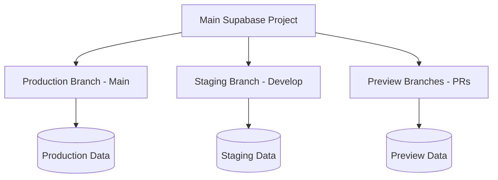

# Supabase Branching Strategy

## Overview

Supabase branches allow you to create isolated database environments within a single project, perfect for staging/preview environments while keeping production separate.

## How Supabase Branches Work



## Benefits of Using Branches

✅ **Single Project Management** - One Supabase project to manage
✅ **Easy Branch Creation** - Create branches directly from Git branches
✅ **Automatic Cleanup** - Preview branches deleted when PR closes
✅ **Schema Sync** - Branches can sync schema from production
✅ **Cost Effective** - Branches are cheaper than separate projects
✅ **Integrated with Git** - Branches match your Git workflow

## Setting Up Branches

### 1. Enable Branching in Supabase

1. Go to your Supabase project dashboard
2. Navigate to Settings → General
3. Enable "Enable branching for this project"

### 2. Create Staging Branch

```bash
# In your project directory
supabase branches create staging --git-branch develop
```

This creates a persistent staging branch linked to your `develop` Git branch.

### 3. Configure Vercel Environment Variables

Each branch gets its own connection string:

**Production (main branch)**
```
VITE_SUPABASE_URL=https://[project-id].supabase.co
VITE_SUPABASE_ANON_KEY=eyJ...[main-branch-key]...
```

**Staging (develop branch)**
```
VITE_SUPABASE_URL=https://[branch-id].supabase.co
VITE_SUPABASE_ANON_KEY=eyJ...[staging-branch-key]...
```

**Preview (PR branches)**
```
# Automatically created for each PR
VITE_SUPABASE_URL=https://[pr-branch-id].supabase.co
VITE_SUPABASE_ANON_KEY=eyJ...[pr-branch-key]...
```

## Workflow Integration

### Automatic Branch Creation

When you create a PR, Supabase can automatically create a preview branch:

```yaml
# .github/workflows/supabase-preview.yml
name: Create Supabase Preview Branch

on:
  pull_request:
    types: [opened, reopened]

jobs:
  create-preview:
    runs-on: ubuntu-latest
    steps:
      - uses: actions/checkout@v4
      
      - name: Create Supabase preview branch
        run: |
          npx supabase branches create pr-${{ github.event.number }} \
            --git-branch ${{ github.head_ref }}
      
      - name: Get branch connection details
        id: branch-details
        run: |
          BRANCH_URL=$(npx supabase branches show pr-${{ github.event.number }} --json | jq -r '.url')
          BRANCH_KEY=$(npx supabase branches show pr-${{ github.event.number }} --json | jq -r '.anon_key')
          echo "url=$BRANCH_URL" >> $GITHUB_OUTPUT
          echo "key=$BRANCH_KEY" >> $GITHUB_OUTPUT
      
      - name: Update PR with connection details
        uses: actions/github-script@v7
        with:
          script: |
            github.rest.issues.createComment({
              issue_number: context.issue.number,
              owner: context.repo.owner,
              repo: context.repo.repo,
              body: `🌿 Supabase preview branch created!\n\nBranch URL: \`${{ steps.branch-details.outputs.url }}\``
            });
```

### Branch Cleanup

```yaml
# .github/workflows/supabase-cleanup.yml
name: Cleanup Supabase Preview Branch

on:
  pull_request:
    types: [closed]

jobs:
  cleanup:
    runs-on: ubuntu-latest
    steps:
      - name: Delete Supabase preview branch
        run: |
          npx supabase branches delete pr-${{ github.event.number }} --confirm
```

## Data Management

### Seeding Branches

Create seed data for new branches:

```typescript
// supabase/seed.ts
export async function seed() {
  // Add test users
  await supabase.auth.admin.createUser({
    email: 'test@example.com',
    password: 'testpassword',
  });
  
  // Add test campaigns
  await supabase.from('campaigns').insert([
    { name: 'Test Campaign', description: 'Seeded test data' }
  ]);
}
```

### Migrating Between Branches

```bash
# Apply migrations from main to staging
supabase db push --branch staging

# Reset branch to match main
supabase branches reset staging --from main
```

## Environment Detection

Add branch detection to your app:

```typescript
// utils/environment.ts
export function getCurrentEnvironment() {
  const url = import.meta.env.VITE_SUPABASE_URL;
  
  // Main project URL = production
  if (!url.includes('-branch-')) {
    return 'production';
  }
  
  // Branch URLs contain '-branch-'
  if (url.includes('staging-branch-')) {
    return 'staging';
  }
  
  return 'preview';
}

// Show environment badge
export function EnvironmentBadge() {
  const env = getCurrentEnvironment();
  
  const badges = {
    production: { text: 'PROD', color: 'green' },
    staging: { text: 'STAGING', color: 'yellow' },
    preview: { text: 'PREVIEW', color: 'blue' }
  };
  
  return (
    <div className={`badge badge-${badges[env].color}`}>
      {badges[env].text}
    </div>
  );
}
```

## Best Practices

1. **Production Branch** = Main Git branch (no suffix in URL)
2. **Staging Branch** = Develop Git branch (persistent branch)
3. **Preview Branches** = PR branches (temporary, auto-cleanup)
4. **Local Development** = Use staging branch or local Supabase

## Migration from Current Setup

Since you already have a project with test data:

1. Your current main database becomes production (clean it first)
2. Create a staging branch for develop
3. Enable automatic preview branches for PRs
4. Update Vercel env vars to use branch-specific URLs

This gives you proper environment isolation without creating multiple projects!