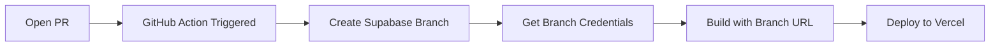

# Supabase Branch Setup Guide

## Prerequisites

1. **Supabase CLI** installed: `npm install -g supabase`
2. **Supabase Access Token**: Get from https://app.supabase.com/account/tokens
3. **Project ID**: Found in your Supabase project settings

## Step 1: Enable Branching

1. Go to your Supabase dashboard
2. Navigate to Settings → General
3. Enable "Branching" (if available in your plan)

## Step 2: Run Setup Script

```bash
# Set environment variables
export SUPABASE_PROJECT_ID=your-project-id
export SUPABASE_ACCESS_TOKEN=your-access-token

# Run setup script
./scripts/setup-supabase-branches.sh
```

This script will:
- Create a staging branch linked to `develop`
- Output environment variables for Vercel
- Optionally update your `.env.local`

## Step 3: Configure GitHub Secrets

Add these secrets to your GitHub repository:

```bash
SUPABASE_PROJECT_ID=your-project-id
SUPABASE_ACCESS_TOKEN=your-access-token
VERCEL_TOKEN=your-vercel-token
VERCEL_ORG_ID=your-vercel-org-id
VERCEL_PROJECT_ID=your-vercel-project-id

# For staging fallback
STAGING_SUPABASE_URL=https://staging-branch-xxx.supabase.co
STAGING_SUPABASE_ANON_KEY=eyJ...staging-key...
```

## Step 4: Configure Vercel Environment Variables

In Vercel Dashboard → Settings → Environment Variables:

### Production (main branch only)
```
VITE_SUPABASE_URL = https://[project-id].supabase.co
VITE_SUPABASE_ANON_KEY = eyJ...[main-anon-key]...
```

### Preview (all preview deployments)
```
# These will be overridden by GitHub Actions for PR branches
VITE_SUPABASE_URL = https://staging-branch-[id].supabase.co
VITE_SUPABASE_ANON_KEY = eyJ...[staging-anon-key]...
```

## Step 5: Add Environment Badge (Optional)

In your root layout component:

```tsx
import { EnvironmentBadge } from '@/components/ui/environment-badge'

export function RootLayout({ children }) {
  return (
    <>
      {children}
      <EnvironmentBadge />
    </>
  )
}
```

## How It Works

### Branch Creation Flow



### Branch Mapping

| Git Branch | Supabase Branch | When Created | Auto Cleanup |
|------------|----------------|--------------|--------------|
| main | main (or root) | Always exists | No |
| develop | staging | Manual setup | No |
| feature/* | pr-[number] | On PR open | On PR close |

## Testing Your Setup

### 1. Test Staging Branch
```bash
git checkout develop
git push
# Check deployment uses staging Supabase
```

### 2. Test Preview Branch
```bash
git checkout -b feature/test-branch
git push -u origin feature/test-branch
# Open PR
# Check PR comment for branch creation
# Check deployment uses preview branch
```

### 3. Test Production
```bash
git checkout main
git merge develop
git push
# Check deployment uses production Supabase
```

## Troubleshooting

### Branch creation fails
- Check Supabase plan supports branching
- Verify access token has correct permissions
- Check project ID is correct

### Wrong environment in deployment
- Check Vercel environment variables
- Verify GitHub Actions secrets
- Check branch detection logic

### Preview branch not cleaned up
- Check GitHub Actions logs
- Manually delete: `supabase branches delete pr-123`

## Manual Branch Management

```bash
# List all branches
supabase branches list --project-ref [project-id]

# Create branch manually
supabase branches create [name] --project-ref [project-id]

# Delete branch manually
supabase branches delete [name] --project-ref [project-id] --confirm

# Get branch details
supabase branches show [name] --project-ref [project-id]
```