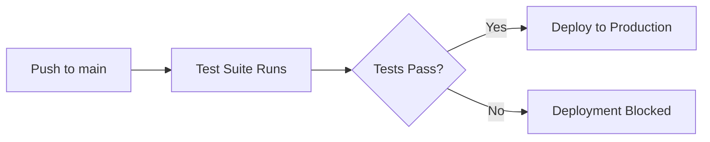
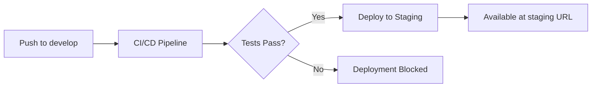
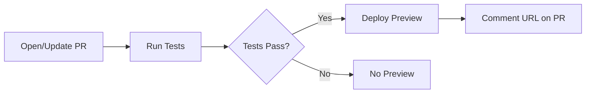

# Vercel Deployment Configuration

This document explains how SessionForge is configured to deploy to Vercel with test-gated deployments.

## Overview

SessionForge uses a **test-gated deployment strategy** where deployments to Vercel only occur after all tests pass. This ensures zero broken deployments.

## Configuration

### 1. Automatic Deployments Disabled

The `vercel.json` file disables Vercel's automatic GitHub deployments:

```json
{
  "github": {
    "enabled": false,
    "silent": true
  },
  "git": {
    "deploymentEnabled": false
  }
}
```

### 2. GitHub Actions Integration

Deployments are controlled through GitHub Actions workflows:

- **Production Deployments**: Only trigger after the "Deployment with Test Gates" workflow succeeds
- **Preview Deployments**: Run tests first, then deploy preview for PRs

### 3. Required Secrets

Add these secrets to your GitHub repository:

```bash
VERCEL_ORG_ID      # Your Vercel organization ID
VERCEL_PROJECT_ID  # Your Vercel project ID  
VERCEL_TOKEN       # Your Vercel API token
```

To get these values:

1. Install Vercel CLI: `npm i -g vercel`
2. Link your project: `vercel link`
3. Get values from `.vercel/project.json`:
   - `orgId` → `VERCEL_ORG_ID`
   - `projectId` → `VERCEL_PROJECT_ID`
4. Create token at: https://vercel.com/account/tokens

## Deployment Flow

### Production (main branch)



### Staging (develop branch)



### Preview (Pull Requests)



### Feature Branches

Feature branches (`feature/*`) do NOT trigger automatic deployments. They only get deployed when:
1. A pull request is opened (preview deployment)
2. They are merged to `develop` (staging deployment)
3. They are merged to `main` (production deployment)

## Manual Deployment

If needed, you can manually deploy using the Vercel CLI:

```bash
# Deploy to production (requires all tests to pass locally first)
npm run test:run && vercel --prod

# Deploy preview
vercel
```

## Rollback

If a bad deployment somehow makes it through:

1. Use Vercel dashboard to instantly rollback
2. Or use CLI: `vercel rollback`

## Monitoring

- Check deployment status in GitHub Actions tab
- View deployment history in Vercel dashboard
- All deployments are linked to their git commits

## Troubleshooting

### Deployment not triggering?

1. Check if tests are passing in GitHub Actions
2. Verify secrets are correctly set
3. Check workflow run logs

### Vercel still auto-deploying?

1. Ensure `vercel.json` is committed and pushed
2. Check Vercel project settings and disable Git integration
3. Disconnect and reconnect the GitHub integration if needed